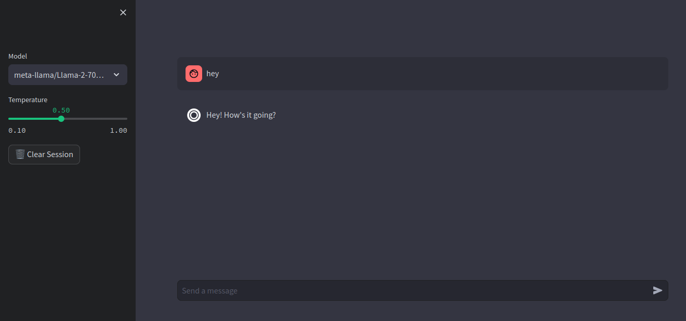

# Nyx Chatbot UI

This project provides a user-friendly web-based user interface for interacting with Nyx Chatbot. It's powered by Streamlit, making it easy to deploy and use.

## Features

- Interactive chat interface.
- Conversational interaction with Nyx Chatbot.
- Easy to deploy and use.

## Prerequisites

Before you begin, ensure you have met the following requirements:

- Python 3.6 or later installed.
- Required Python packages installed. You can install them using pip:

```bash
pip install -r requirements.txt
```

## Usage

1. Clone this repository to your local machine:

```bash
git clone https://github.com/mishalhossin/NyX-Chatbot-UI.git
```

2. Navigate to the project directory:

```bash
cd nyx-chatbot-ui
```

3. Run the Streamlit app:

```bash
python -m streamlit run app.py
```

4. Open your web browser and access the chat UI at `http://localhost:8501`.

5. Start chatting with Nyx Chatbot!

## Configuration

You can configure the chatbot's behavior and appearance by modifying the `config.py` file.

## Screenshots



## Contributing

Contributions are welcome! Please feel free to open an issue or submit a pull request.

## License

This project is licensed under the MIT License. See the [LICENSE](LICENSE) file for details.